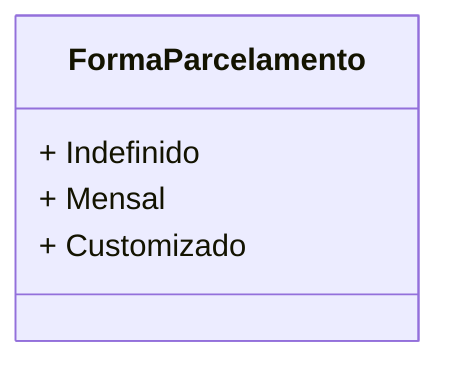

# FormaParcelamento
**Namespace**: IsthmusWinthor.Dominio.Enumeradores  
**Nome do Arquivo**: FormaParcelamento.cs  

O `FormaParcelamento` é um enumerador que define as possíveis formas de parcelamento disponíveis no sistema, permitindo que diferentes opções sejam aplicadas em transações financeiras. Este recurso é crucial para a flexibilidade nas condições de pagamento.

## Tipos Auxiliares e Dependências
- `FormaParcelamento` é um enum que define:
  - `Indefinido`: Representa uma forma de parcelamento não especificada.
  - `Mensal`: Indica que o parcelamento será mensal.
  - `Customizado`: Permite um parcelamento que pode ser adaptado conforme necessidades específicas.

## Diagrama de Relacionamentos

