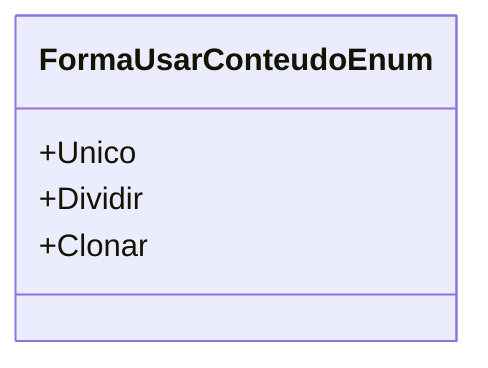

# FormaUsarConteudoEnum
**Namespace**: IsthmusWinthor.Dominio.Enumeradores  
**Nome do Arquivo**: FormaUsarConteudoEnum.cs  

O `FormaUsarConteudoEnum` é um enumerador que define diferentes maneiras de utilizarmos o conteúdo em um sistema. Sua finalidade principal é orientar a lógica de uso do conteúdo, garantindo que os dados sejam manipulados conforme a estratégia desejada.

## Tipos Auxiliares e Dependências
- **Enums**:
  - `[FormaUsarConteudoEnum](FormaUsarConteudoEnum.md)`

### Descrições dos Valores
- **Unico**: Indica que o conteúdo deve ser utilizado apenas uma vez, mantendo sua integridade e evitando duplicações.
- **Dividir**: Define que o conteúdo deve ser repartido entre diferentes campos, permitindo uma abordagem mais flexível e adaptativa nos formatos de exibição dos dados.
- **Clonar**: Permite que o conteúdo seja copiado para múltiplos campos, facilitando a replicação de informações onde apropriado.

## Diagrama de Relacionamentos

Este documento fornece um panorama claro sobre o enumerador `FormaUsarConteudoEnum` e suas possíveis utilizações no contexto de uma aplicação, assegurando a integridade dos dados conforme as regras definidas.
