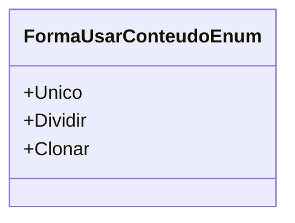

# FormaUsarConteudoEnum
**Namespace**: IsthmusWinthor.Dominio.Enumeradores  
**Nome do Arquivo**: FormaUsarConteudoEnum.cs  

Esta enumeração define as formas de utilização do conteúdo no sistema, fornecendo um conjunto de opções que orientam como os dados devem ser manipulados entre os campos.

## Tipos Auxiliares e Dependências
- **Enumeradores**:
  - [FormaUsarConteudoEnum](FormaUsarConteudoEnum.md) 

## Diagrama de Relacionamentos

---
Gerada em 29/12/2025 20:55:36
