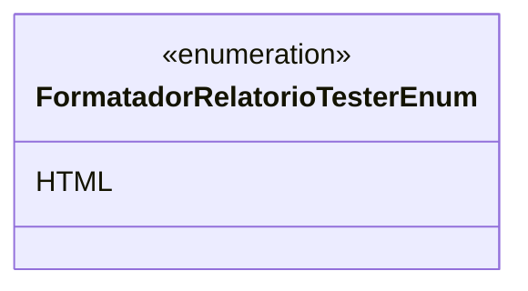

# FormatadorRelatorioTesterEnum
**Namespace**: IsthmusWinthor.Dominio.Enumeradores  
**Nome do Arquivo**: FormatadorRelatorioTesterEnum.cs  

Este enumerador é utilizado para definir os formatos de relatório disponíveis no sistema, facilitando a formatação e apresentação dos dados em diferentes contextos.

## Tipos Auxiliares e Dependências
- **Enum**:
  - [FormatadorRelatorioTesterEnum](FormatadorRelatorioTesterEnum.md)

## Diagrama de Relacionamentos

---
Gerada em 29/12/2025 20:55:31
