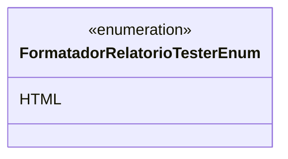

# FormatadorRelatorioTesterEnum
**Namespace**: IsthmusWinthor.Dominio.Enumeradores  
**Nome do Arquivo**: FormatadorRelatorioTesterEnum.cs  

O `FormatadorRelatorioTesterEnum` é um enumerador que define formatos de relatório para utilização em testes.

## Tipos Auxiliares e Dependências
- **Enumeradores**:  
  - `[FormatadorRelatorioTesterEnum](FormatadorRelatorioTesterEnum.md)`: Define os formatos de relatório disponíveis.

## Diagrama de Relacionamentos

