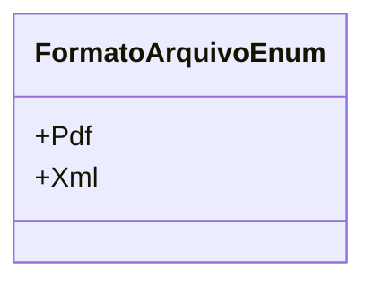

# FormatoArquivoEnum
**Namespace**: IsthmusWinthor.Dominio.Enumeradores  
**Nome do Arquivo**: FormatoArquivoEnum.cs  

O `FormatoArquivoEnum` é uma enumeração que define os formatos de arquivo disponíveis no sistema. Ele facilita a seleção de tipos de arquivo para exportação e importação de dados, garantindo que as opções sejam limitadas e fáceis de gerenciar no contexto do domínio.

## Tipos Auxiliares e Dependências
- `FormatoArquivoEnum` - Enumeração que representa os formatos de arquivos disponíveis: PDF e XML.

## Diagrama de Relacionamentos

