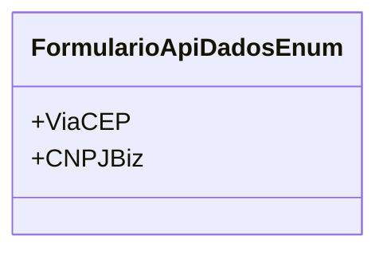

# FormularioApiDadosEnum
**Namespace**: IsthmusWinthor.Dominio.Enumeradores  
**Nome do Arquivo**: FormularioApiDadosEnum.cs  

## Visão Geral e Responsabilidade
Este enumerador define as opções disponíveis para formulários de API, especificamente para integrações com serviços externos que fornecem dados via APIs. Cada valor do enumerador representa uma fonte de dados distinta que pode ser utilizada ao interagir com APIs, facilitando a identificação e o manuseio de diferentes tipos de solicitações.

## Tipos Auxiliares e Dependências
- Nenhum tipo auxiliar ou dependência complexa relacionada a esta enumeração.

## Diagrama de Relacionamentos

