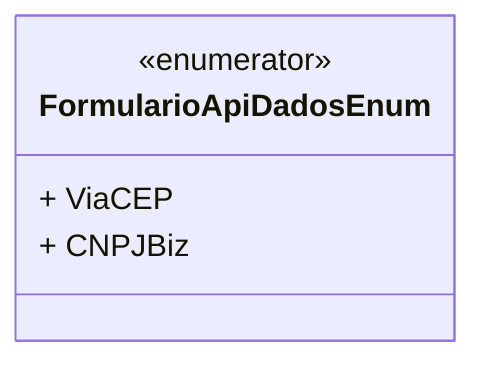

# FormularioApiDadosEnum
**Namespace**: IsthmusWinthor.Dominio.Enumeradores  
**Nome do Arquivo**: FormularioApiDadosEnum.cs  

Este enumerador é responsável por definir as fontes de dados que podem ser utilizadas ao interagir com a API de formulários, garantindo que o sistema tenha um conjunto controlado de opções para a obtenção de informações através de diferentes serviços.

## Tipos Auxiliares e Dependências
- Enumeradores:
  - [FormularioApiDadosEnum](FormularioApiDadosEnum.md)

## Diagrama de Relacionamentos

---
Gerada em 29/12/2025 20:55:39
