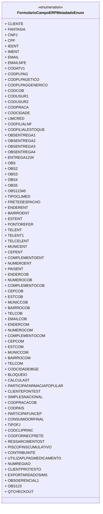

# FormularioCampoERPMetadadoEnum
**Namespace**: IsthmusWinthor.Dominio.Enumeradores  
**Nome do Arquivo**: FormularioCampoERPMetadadoEnum.cs  

Este é um enumerador que contém constantes representando os campos de metadados do formulário ERP, cada um associado a um identificador numérico. Esses campos são usados para estruturar e validar dados relevantes para clientes e transações comerciais.

## Tipos Auxiliares e Dependências
- Nenhum

## Diagrama de Relacionamentos

---
Gerada em 29/12/2025 20:55:52
