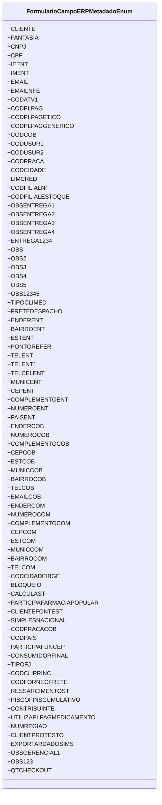

# FormularioCampoERPMetadadoEnum
**Namespace**: IsthmusWinthor.Dominio.Enumeradores  
**Nome do Arquivo**: FormularioCampoERPMetadadoEnum.cs  

## Visão Geral e Responsabilidade
A classe `FormularioCampoERPMetadadoEnum` é uma enumeração que define os diferentes campos de metadados utilizados no sistema ERP (Enterprise Resource Planning). Cada valor enum representa uma característica específica de um cliente ou fornecedor, como, por exemplo, Razão Social, CNPJ, informações de Endereço e restrições relacionadas a crédito. Esta enumeração assegura que os campos correspondam a constantes nomeadas em vez de números mágicos, promovendo a integridade dos dados e facilitando a manutenção do código.

## Métodos de Negócio
Não há métodos com lógica complexa nesta classe, uma vez que ela contém apenas definições de enumeradores.

## Propriedades Calculadas e de Validação
Não existem propriedades calculadas ou de validação nesta enumeração, pois ela é composta apenas de constantes.

## Navigations Property
Não há propriedades que representem classes complexas do domínio a serem listadas, pois todos os valores pertencem a um tipo enumerador.

## Tipos Auxiliares e Dependências
- Não existem enums ou classes estáticas/helpers adicionais utilizadas nesta enumeração além da própria enumeração.

## Diagrama de Relacionamentos

