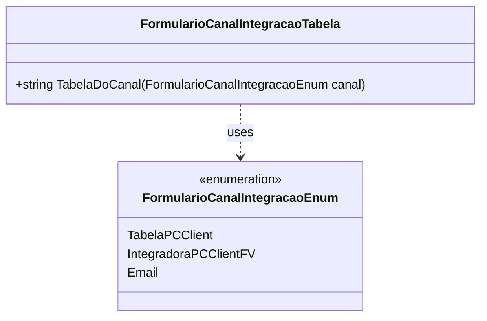

# FormularioCanalIntegracaoEnum

- **Namespace**: IsthmusWinthor.Dominio.Enumeradores
- **Nome do Arquivo**: FormularioCanalIntegracaoEnum.cs

O `FormularioCanalIntegracaoEnum` define os diferentes canais de integração que o sistema pode utilizar para formular interações, desempenhando um papel crucial na configuração de rotinas de integração.

---

# FormularioCanalIntegracaoTabela

- **Namespace**: IsthmusWinthor.Dominio.Enumeradores
- **Nome do Arquivo**: FormularioCanalIntegracaoTabela.cs

## Visão Geral e Responsabilidade
A classe `FormularioCanalIntegracaoTabela` é responsável por mapear os valores do enumerador `FormularioCanalIntegracaoEnum` para suas respectivas tabelas no sistema. Esta classe desempenha um papel essencial na definição clara de quais tabelas devem ser utilizadas de acordo com o canal de integração especificado, garantindo que a aplicação possa interagir corretamente com diferentes sistemas e formatos.

## Métodos de Negócio

### Título: `TabelaDoCanal` (public static)

- **Objetivo**: Este método assegura que, dado um canal de integração, a tabela correspondente seja retornada, ajudando na manutenção da integridade do mapeamento entre canais e suas respectivas tabelas.
  
- **Comportamento**:
  1. O método recebe um parâmetro do tipo `FormularioCanalIntegracaoEnum`.
  2. Avalia o canal fornecido através de um `switch`.
  3. Se o canal for `IntegradoraPCClientFV`, retorna a string `"PCCLIENTFV"`.
  4. Se o canal for `TabelaPCClient`, retorna a string `"PCCLIENT"`.
  5. Para qualquer outro valor passado, retorna uma string vazia.

- **Retorno**: O método retorna o nome da tabela correspondente ao canal de integração. Se o canal não for reconhecido, retorna uma string vazia.

## Propriedades Calculadas e de Validação

Nenhuma propriedade com lógica de cálculo ou validação foi identificada nesta classe.

## Navigations Property

Nenhuma propriedade que represente classes complexas do domínio foi identificada nesta classe.

## Tipos Auxiliares e Dependências

- Enumeradores:
  - `[FormularioCanalIntegracaoEnum](FormularioCanalIntegracaoEnum.md)`

## Diagrama de Relacionamentos

