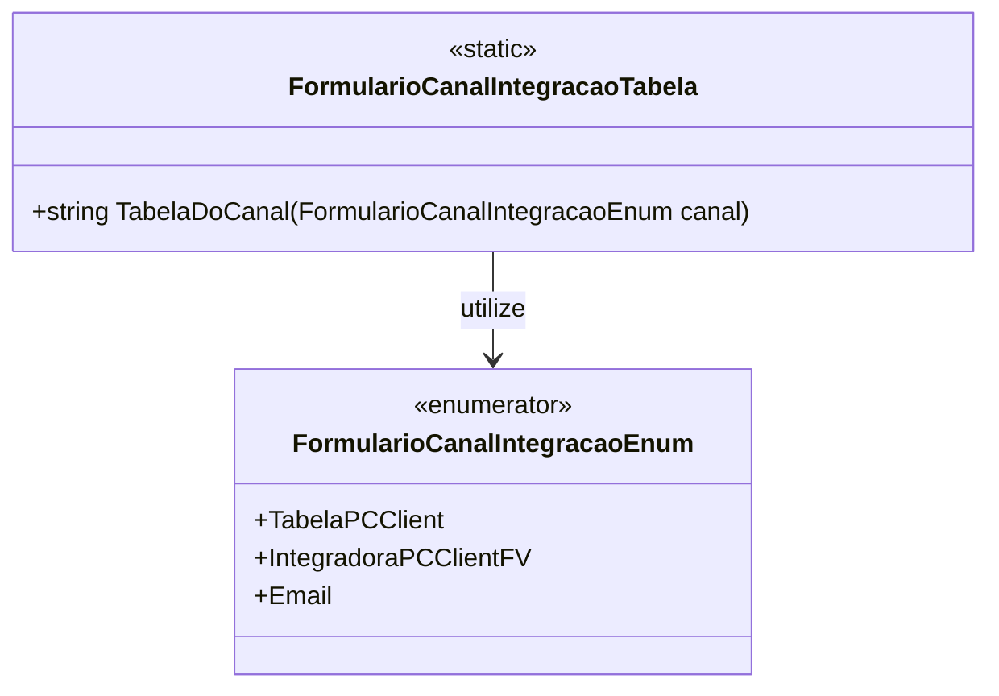

# FormularioCanalIntegracaoTabela

- **Namespace**: IsthmusWinthor.Dominio.Enumeradores
- **Nome do Arquivo**: FormularioCanalIntegracaoTabela.cs

## Visão Geral e Responsabilidade
A classe `FormularioCanalIntegracaoTabela` atua como um utilitário que fornece uma tabela de integração para diferentes canais de um formulário. Seu papel é converter um `FormularioCanalIntegracaoEnum` em uma string correspondente à tabela correta, resolvendo o problema de mapeamento entre o canal de integração e a sua respectiva tabela de dados.

## Métodos de Negócio

### Título: TabelaDoCanal (Método Estático)
- **Objetivo**: Garantir que cada tipo de canal de integração tenha uma representação em string correspondente utilizada em operações de integração.
- **Comportamento**: 
  1. Recebe um parâmetro do tipo `FormularioCanalIntegracaoEnum`.
  2. Avalia o valor do enum.
     - Se for `IntegradoraPCClientFV`, retorna a string "PCCLIENTFV".
     - Se for `TabelaPCClient`, retorna a string "PCCLIENT".
     - Para qualquer outro valor, retorna uma string vazia.
- **Retorno**: Retorna uma string que representa a tabela correspondente ao canal de integração, ou uma string vazia se o canal não for mapeado.

```mermaid
flowchart TD
    A[Recebe canal] --> B{Avalia canal}
    B -->|IntegradoraPCClientFV| C["Retorna PCMCLIENTFV"]
    B -->|TabelaPCClient| D["Retorna PCCLIENT"]
    B -->|Outro| E["Retorna "" " (vazio)]
```

## Propriedades Calculadas e de Validação
- Não se aplica, pois a classe não possui propriedades com lógica no `get` ou validação no `set`.

## Navigations Property
- Não se aplica, pois a classe não possui propriedades que são classes complexas do domínio.

## Tipos Auxiliares e Dependências
- **Enumeradores**:
  - [FormularioCanalIntegracaoEnum](FormularioCanalIntegracaoEnum.md)

## Diagrama de Relacionamentos

---
Gerada em 29/12/2025 20:56:03
