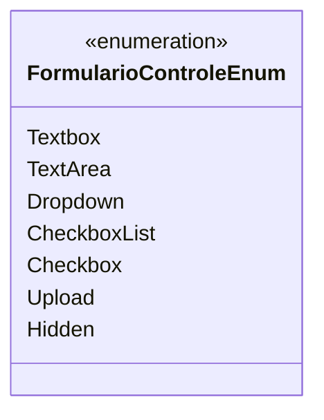

# FormularioControleEnum
**Namespace**: IsthmusWinthor.Dominio.Enumeradores  
**Nome do Arquivo**: FormularioControleEnum.cs  

> Enumeração que define os tipos de controle de formulário utilizados no sistema.

## Tipos Auxiliares e Dependências
- Enum `FormularioControleEnum`: Esta enumeração é utilizada para categorizar diferentes tipos de entradas de dados em formulários, permitindo a escolha do tipo adequado para cada campo.

## Diagrama de Relacionamentos

