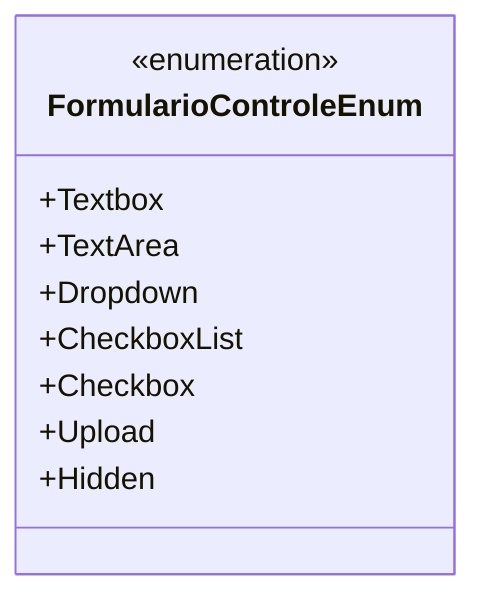

# FormularioControleEnum
**Namespace**: IsthmusWinthor.Dominio.Enumeradores  
**Nome do Arquivo**: FormularioControleEnum.cs

O `FormularioControleEnum` é um enumerador que define diferentes tipos de controle que podem ser usados em formulários, facilitando a construção de interfaces de usuário que se adaptam à necessidade de entrada de dados do usuário.

## Tipos Auxiliares e Dependências
- Este enumerador é utilizado em diversas partes da aplicação para especificar que tipo de controle deve ser exibido ao usuário, garantindo um comportamento consistente nas interfaces.
  
## Enumerações
- `Texto em apenas uma linha (text)` - `Textbox`: Representa um campo de texto que aceita uma única linha de entrada.
- `Texto em várias linhas (textarea)` - `TextArea`: Representa um campo que permite a entrada de texto em várias linhas.
- `Lista de escolha única (dropdown)` - `Dropdown`: Representa uma lista suspensa que permite ao usuário selecionar uma única opção entre várias disponíveis.
- `Lista de várias escolhas (check list)` - `CheckboxList`: Representa uma lista onde o usuário pode selecionar várias opções entre as apresentadas.
- `Opção para marcar ou desmarcar (check)` - `Checkbox`: Representa um controle que permite ao usuário selecionar uma opção binária, marcada ou desmarcada.
- `Upload de Arquivo (file)` - `Upload`: Representa um controle que permite ao usuário fazer upload de arquivos.
- `Campo Escondido (hidden)` - `Hidden`: Representa um campo que não é exibido na interface, mas que mantém dados que podem ser enviados ao servidor.

## Diagrama de Relacionamentos

---
Gerada em 29/12/2025 20:56:11
