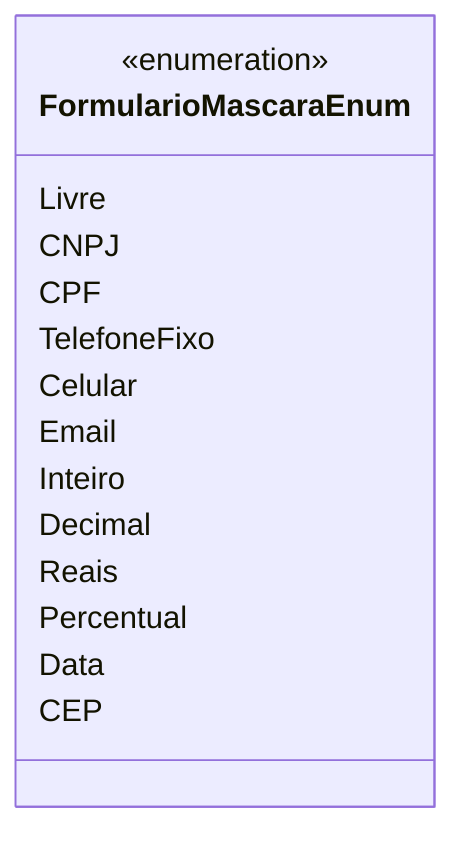

# FormularioMascaraEnum
**Namespace**: IsthmusWinthor.Dominio.Enumeradores  
**Nome do Arquivo**: FormularioMascaraEnum.cs

O `FormularioMascaraEnum` é uma enumeração que define diferentes tipos de máscaras que podem ser aplicadas a campos de entrada em um formulário. Cada tipo de máscara representa um formato específico de dados a ser inserido pelo usuário, garantindo que as informações sejam capturadas de maneira consistente e adequada às regras de negócio.

## Tipos Auxiliares e Dependências
- **Nenhum tipo estático ou helper adicional é utilizado nesta enumeração.**

## Diagrama de Relacionamentos

