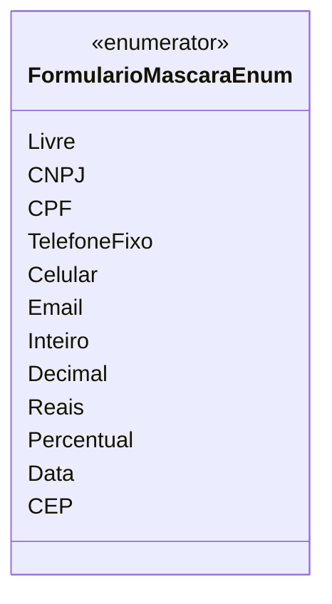

# FormularioMascaraEnum

**Namespace**: IsthmusWinthor.Dominio.Enumeradores  
**Nome do Arquivo**: FormularioMascaraEnum.cs

O `FormularioMascaraEnum` é um enumerador que define diferentes tipos de máscaras de entrada de dados que podem ser aplicadas a campos de formulários. Ele é usado para garantir que os dados inseridos pelo usuário atendam a formatos predefinidos, assegurando integridade e validade dos dados.

## Tipos Auxiliares e Dependências
- Nenhum.

## Diagrama de Relacionamentos

---
Gerada em 29/12/2025 20:56:14
