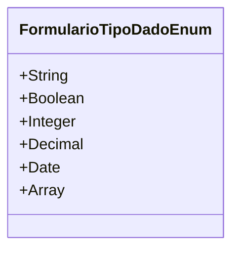

# FormularioTipoDadoEnum
**Namespace**: IsthmusWinthor.Dominio.Enumeradores  
**Nome do Arquivo**: FormularioTipoDadoEnum.cs  

O `FormularioTipoDadoEnum` é uma enumeração que define os tipos de dados disponíveis para formulários em um sistema. Cada tipo representa uma categoria específica de dados que podem ser manipulados dentro da aplicação, garantindo que os dados sejam tratados adequadamente conforme suas características.

## Tipos Auxiliares e Dependências
- **Enumeradores:**
  - [FormularioTipoDadoEnum](FormularioTipoDadoEnum.md)

## Diagrama de Relacionamentos

---
Gerada em 29/12/2025 20:56:18
