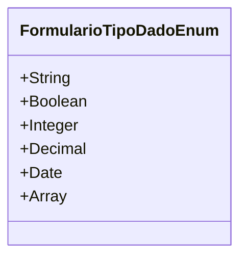

# FormularioTipoDadoEnum
**Namespace**: IsthmusWinthor.Dominio.Enumeradores  
**Nome do Arquivo**: FormularioTipoDadoEnum.cs  

'FormularioTipoDadoEnum' é um enumerador que define os tipos de dados que podem ser utilizados em formulários dentro do sistema. Ele é utilizado para garantir que os dados capturados estejam de acordo com as expectativas de tipo, facilitando a validação e o processamento correto dos dados.

## Tipos Auxiliares e Dependências
- Nenhum tipo auxiliar ou dependência é utilizado diretamente por esta classe além dos padrões de tipos do C#.

## Diagrama de Relacionamentos

