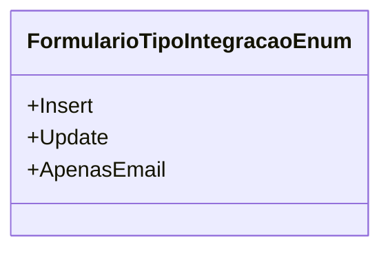

# FormularioTipoIntegracaoEnum
**Namespace**: IsthmusWinthor.Dominio.Enumeradores  
**Nome do Arquivo**: FormularioTipoIntegracaoEnum.cs  

`FormularioTipoIntegracaoEnum` é um enumerador que serve como uma definição de tipos de operação que podem ser realizadas em um formulário de integração. Este enum é usado para categorizar as ações possíveis sobre um formulário, facilitando o gerenciamento de fluxos de dados no sistema.

## Tipos Auxiliares e Dependências
- `Insert`: Representa uma operação de inserção de dados.
- `Update`: Indica que a operação é uma atualização de dados existentes.
- `ApenasEmail`: Especifica que apenas a operação de envio de e-mail está sendo realizada, sem alterações nos dados.

### Diagrama de Relacionamentos

