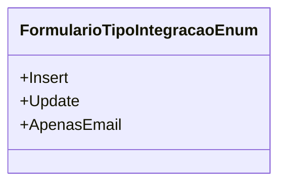

# FormularioTipoIntegracaoEnum
**Namespace**: IsthmusWinthor.Dominio.Enumeradores  
**Nome do Arquivo**: FormularioTipoIntegracaoEnum.cs

> Este enumerador define os tipos de integração de formulário utilizados no sistema.

## Tipos Auxiliares e Dependências
- Este enumerador é utilizado para categorizar o tipo de operação de integração de formulário, facilitando a determinação da ação que deve ser executada no sistema quando um formulário é processado. 

### Valores do Enumerador:
- `Insert`: Representa uma operação de inserção de dados.
- `Update`: Representa uma operação de atualização de dados existentes.
- `ApenasEmail`: Indica que apenas o envio de um email deve ser realizado, sem inserção ou atualização de dados.

## Diagrama de Relacionamentos

---
Gerada em 29/12/2025 20:56:21
