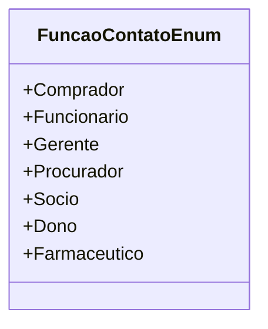

# FuncaoContatoEnum
**Namespace**: IsthmusWinthor.Dominio.Enumeradores  
**Nome do Arquivo**: FuncaoContatoEnum.cs  

O `FuncaoContatoEnum` é um enumerador que define as funções possíveis que um contato pode ter dentro do sistema. Ele é utilizado para garantir a integridade e a validação dos dados ao classificar um contato em uma das funções predefinidas, facilitando a gestão de contatos.

## Tipos Auxiliares e Dependências
- Nenhum.

## Diagrama de Relacionamentos

---
Gerada em 29/12/2025 20:56:24
