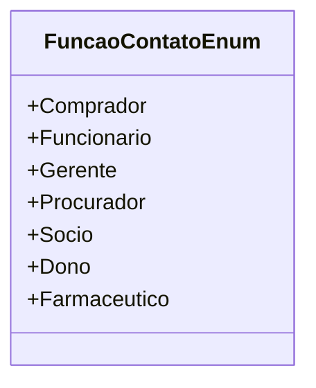

# FuncaoContatoEnum
**Namespace**: IsthmusWinthor.Dominio.Enumeradores  
**Nome do Arquivo**: FuncaoContatoEnum.cs  

Enumera as possíveis funções de contato dentro do sistema, definindo diferentes papéis e responsabilidades que um contato pode ter. Este enumerador é essencial para categorizar e gerenciar usuários da aplicação, facilitando a identificação de suas funções específicas no contexto organizacional.

## Tipos Auxiliares e Dependências
- Nenhum.

## Diagrama de Relacionamentos

