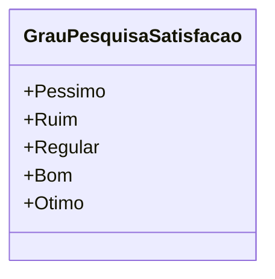

# GrauPesquisaSatisfacao
- **Namespace**: IsthmusWinthor.Dominio.Enumeradores
- **Nome do Arquivo**: GrauPesquisaSatisfacao.cs

Esta classe é um enumerador que define os diferentes níveis de satisfação da pesquisa, permitindo categorizá-los de forma semântica para uso em relatórios e análises de feedback.

## Tipos Auxiliares e Dependências
- **Enumerador**: 
  - `[GrauPesquisaSatisfacao](GrauPesquisaSatisfacao.md)`

## Diagrama de Relacionamentos

