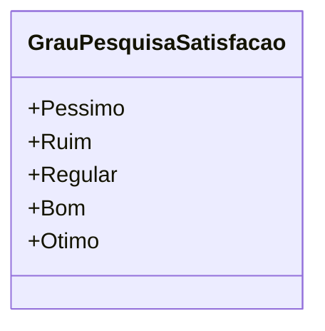

# GrauPesquisaSatisfacao
**Namespace**: IsthmusWinthor.Dominio.Enumeradores  
**Nome do Arquivo**: GrauPesquisaSatisfacao.cs  

O `GrauPesquisaSatisfacao` é um enumerador que categoriza a satisfação dos usuários em uma pesquisa, permitindo assim a representação de diferentes níveis de satisfação.

## Tipos Auxiliares e Dependências
- Nenhum tipo auxiliar ou dependência adicional é utilizado nesta classe.

## Diagrama de Relacionamentos

---
Gerada em 29/12/2025 20:56:27
