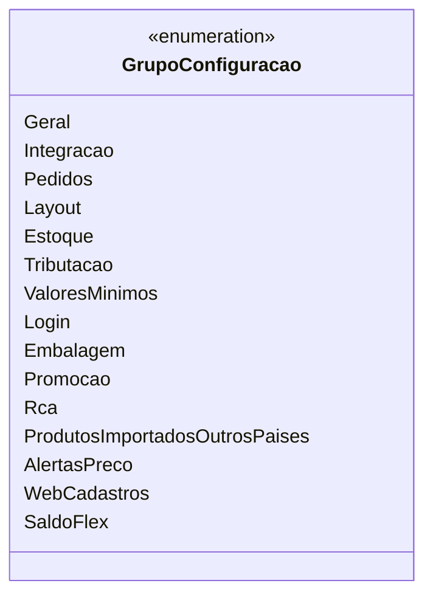

# GrupoConfiguracao

- **Namespace**: IsthmusWinthor.Dominio.Enumeradores
- **Nome do Arquivo**: GrupoConfiguracao.cs

## Visão Geral e Responsabilidade
A enumeração `GrupoConfiguracao` categoriza diferentes grupos de configurações que fazem parte do sistema. Seu papel é facilitar a organização e a escolha das configurações por parte do usuário final, agrupando-as em categorias lógicas que representam funcionalidades específicas do sistema. Isso melhora a experiência do usuário ao navegar pelas opções de configuração disponibles.

## Métodos de Negócio
A classe `GrupoConfiguracao` consiste apenas em um conjunto de enumeradores e, portanto, não contém métodos com lógica de negócio a serem documentados.

## Propriedades Calculadas e de Validação
Não há propriedades calculadas ou de validação nesta enumeração, uma vez que é composta apenas por valores estáticos.

## Navigations Property
Não existem propriedades de navegação nesta enumeração, dado que ela não possui relações com outras classes complexas do domínio.

## Tipos Auxiliares e Dependências
Não há enumeradores ou classes auxiliares que a enumeração `GrupoConfiguracao` dependa, além dos próprios `DisplayAttribute` que não compõem uma classe ou enumeração distinta no domínio.

## Diagrama de Relacionamentos

Este diagrama ilustra a enumeração `GrupoConfiguracao` e suas definições de grupo. Cada valor definido representa uma categoria única e é um componente importante para a configuração do sistema.
---
Gerada em 29/12/2025 20:56:35
