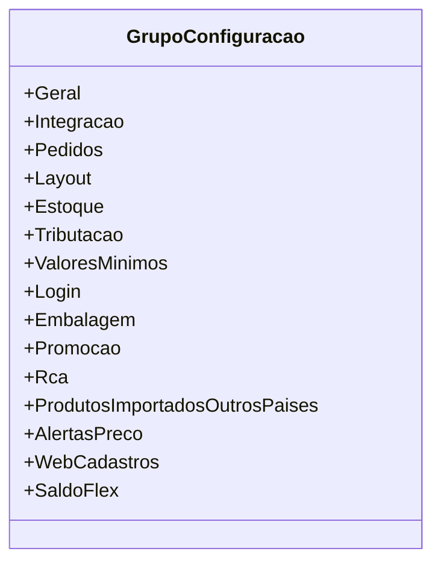

# GrupoConfiguracao

- **Namespace**: IsthmusWinthor.Dominio.Enumeradores
- **Nome do Arquivo**: GrupoConfiguracao.md

## Visão Geral e Responsabilidade
A classe `GrupoConfiguracao` é um enumerador que define diferentes grupos de configuração que podem ser utilizados em um sistema corporativo. Seu propósito é categorizar configurações do sistema, facilitando a identificação e a escolha de opções pelo usuário. Cada grupo representa uma área específica de configuração, como integração de dados, layout do site ou configurações de estoque, entre outros. Essa organização é fundamental para que usuários e administradores tenham uma navegação e um gerenciamento mais intuitivo das configurações.

## Tipos Auxiliares e Dependências
- Não há dependências diretas de classes complexas do domínio.
- Enumeradores utilizados:
  - `GrupoConfiguracao`: enumeração listada acima.

## Diagrama de Relacionamentos

