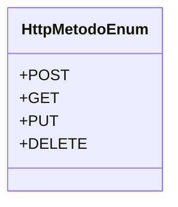

# HttpMetodoEnum
**Namespace**: IsthmusWinthor.Dominio.Enumeradores  
**Nome do Arquivo**: HttpMetodoEnum.cs

O `HttpMetodoEnum` é um enumerador que define os métodos HTTP utilizados nas requisições em um sistema, permitindo a tipificação e controle das operações que podem ser realizadas na API.

## Tipos Auxiliares e Dependências
- Enumeradores:
  - `[HttpMetodoEnum](HttpMetodoEnum.md)`

## Diagrama de Relacionamentos

