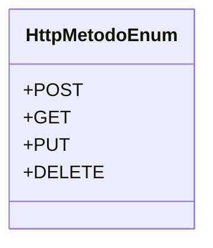

# HttpMetodoEnum

**Namespace**: IsthmusWinthor.Dominio.Enumeradores  
**Nome do Arquivo**: HttpMetodoEnum.cs  

O `HttpMetodoEnum` define os métodos HTTP utilizados nas requisições de serviço, proporcionando um conjunto de valores padrão para garantir a integridade e a padronização nas interações com APIs. Ele resolve o problema de consistência no uso de métodos de requisição, evitando erros de digitação e melhorando a legibilidade do código.

## Tipos Auxiliares e Dependências
- Enumeradores:
  - [HttpMetodoEnum](HttpMetodoEnum.md)  

## Diagrama de Relacionamentos

---
Gerada em 29/12/2025 20:56:39
