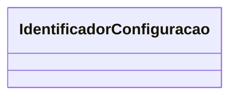

# IdentificadorConfiguracao

**Namespace**: IsthmusWinthor.Dominio.Enumeradores  
**Nome do Arquivo**: IdentificadorConfiguracao.cs  

O `IdentificadorConfiguracao` é um enumerador que define diversos tipos de configurações utilizadas em metadados dentro de um sistema corporativo. Ele garante que as configurações relacionadas a um mesmo conjunto funcional não sejam duplicadas, permitindo o vínculo de metadados com soluções alternadas. Essa estrutura ajuda a manter a integridade e a organização das configurações.

---

## Tipos Auxiliares e Dependências

Os enumeradores definidos nesta classe são atribuídos a diferentes tipos de configuração que influenciam o comportamento do sistema. 

- **Enumeradores:**
  - `IdentificadorConfiguracao`

---

## Diagrama de Relacionamentos

Observa-se que o `IdentificadorConfiguracao` não tem propriedades complexas ou navegações para outras classes, pois é um enumerador puro focado em clarificar diferentes estados/configurações e não encapsula logicamente um modelo de domínio mais complexo.
