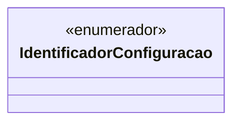

# IdentificadorConfiguracao

**Namespace**: IsthmusWinthor.Dominio.Enumeradores  
**Nome do Arquivo**: IdentificadorConfiguracao.cs

## Visão Geral e Responsabilidade
A classe `IdentificadorConfiguracao` é um enumerador que define uma ampla gama de configurações relacionadas ao sistema de gerenciamento comercial, que impactam diretamente o comportamento e a experiência do usuário em diversos cenários de venda e integração. Este enumerador evita a duplicação de tipos de configuração, promovendo a consistência e a integração eficiente entre diferentes módulos do sistema. As configurações abrangidas incluem opções para controlar a exibição de produtos, gestão de estoque, promoções, métodos de pagamento e muito mais, garantindo que as regras de negócio sejam seguidas de maneira estruturada e centralizada.

## Métodos de Negócio
* Este enumerador não contém métodos de negócio com lógica complexa; ele é definido apenas por enumeradores que têm como objetivo organizar de maneira eficiente e acessível as diferentes configurações disponíveis.

## Propriedades Calculadas e de Validação
* Não existem propriedades calculadas ou de validação na classe, uma vez que este é um enumerador.

## Navigations Property
* Não há propriedades de navegação, já que este é um enumerador isolado sem links diretos para outras classes complexas do domínio.

## Tipos Auxiliares e Dependências
* Não existem enums ou classes adicionais necessárias para o funcionamento deste enumerador, mas ele pode estar associado com outros componentes do sistema, que necessitarão dos identificadores definidos aqui.

## Diagrama de Relacionamentos

Esta documentação fornece uma visão clara de como o `IdentificadorConfiguracao` se articula dentro do sistema, garantindo que as configurações sejam facilmente gerenciáveis e acessíveis, promovendo uma manutenção simplificada e uma experiência de usuário consistente.
---
Gerada em 29/12/2025 20:56:46
