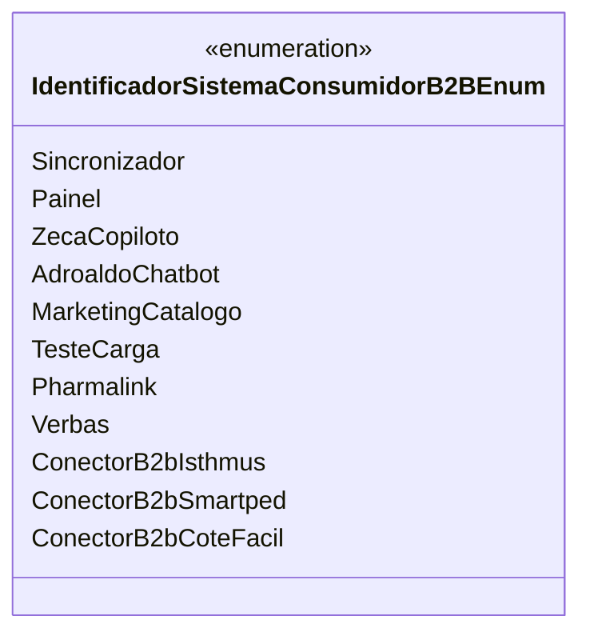

# IdentificadorSistemaConsumidorB2BEnum
**Namespace**: IsthmusWinthor.Dominio.Enumeradores  
**Nome do Arquivo**: IdentificadorSistemaConsumidorB2BEnum.cs  

## Visão Geral e Responsabilidade
O `IdentificadorSistemaConsumidorB2BEnum` é um enumerador que define diversos sistemas consumidores no contexto de negócios B2B (business-to-business). Ele classifica e identifica os diferentes sistemas que podem interagir com a plataforma, permitindo um controle e rastreamento eficazes das várias integrações e funcionalidades do sistema.

## Tipos Auxiliares e Dependências
- Nenhum tipo auxiliar ou dependência adicional é utilizado diretamente pela classe.

## Diagrama de Relacionamentos

