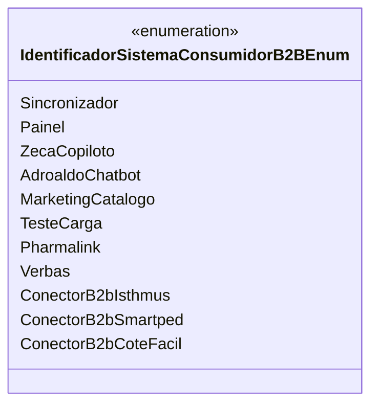

# IdentificadorSistemaConsumidorB2BEnum
**Namespace**: IsthmusWinthor.Dominio.Enumeradores  
**Nome do Arquivo**: IdentificadorSistemaConsumidorB2BEnum.cs  

Este enum é utilizado para definir os identificadores de diferentes sistemas consumidores no contexto B2B, permitindo a categorização e o gerenciamento dos sistemas que interagem com a lógica de negócio.

## Tipos Auxiliares e Dependências
- **Enumeradores**:
  - O enum `IdentificadorSistemaConsumidorB2BEnum` lista os sistemas consumidores disponíveis, cada um associado a um valor inteiro que representa sua identificação única.

```markdown
- `Sincronizador` = 1
- `Painel` = 2
- `ZecaCopiloto` = 5
- `AdroaldoChatbot` = 6
- `MarketingCatalogo` = 7
- `TesteCarga` = 8
- `Pharmalink` = 9
- `Verbas` = 10
- `ConectorB2bIsthmus` = 11
- `ConectorB2bSmartped` = 12
- `ConectorB2bCoteFacil` = 13
```  

## Diagrama de Relacionamentos


Este diagrama ilustra a estrutura do enumerador e suas relações dentro do contexto de sistemas consumidores B2B.
---
Gerada em 29/12/2025 20:56:55
