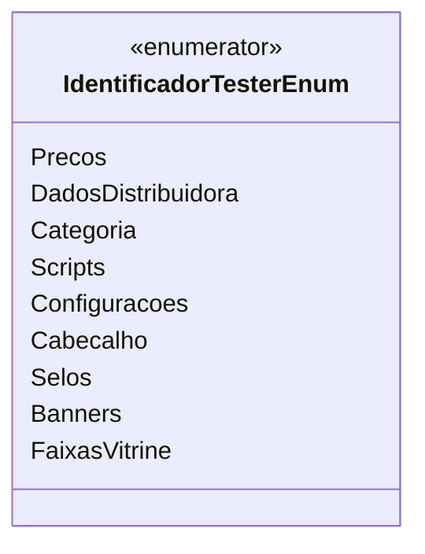

# IdentificadorTesterEnum
**Namespace**: IsthmusWinthor.Dominio.Enumeradores  
**Nome do Arquivo**: IdentificadorTesterEnum.cs  

O `IdentificadorTesterEnum` é um enumerador que serve para categorizar diferentes tipos de identificadores utilizados no sistema, facilitando a manutenção e a legibilidade do código ao fornecer um conjunto de constantes nomeadas.

## Tipos Auxiliares e Dependências
- Nenhum

## Diagrama de Relacionamentos

