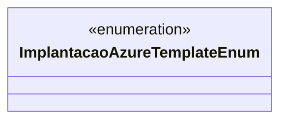

# ImplantacaoAzureTemplateEnum
**Namespace**: IsthmusWinthor.Dominio.Enumeradores  
**Nome do Arquivo**: ImplantacaoAzureTemplateEnum.cs  

Enumeração que define os diferentes templates de implantação no Azure, utilizados para configurar e gerenciar recursos de forma padronizada.

## Tipos Auxiliares e Dependências
- Nenhuma classe complexa do domínio, já que esta é uma enumeração.

### Enumeradores
- `[ImplantacaoAzureTemplateEnum](ImplantacaoAzureTemplateEnum.md)`

## Diagrama de Relacionamentos

--- 

Esta documentação resume a função da enumeração `ImplantacaoAzureTemplateEnum` e suas ligações. Para mais informações sobre como esses enums são utilizados no sistema, você deve consultar os locais onde a enumeração é referenciada na lógica do domínio.
