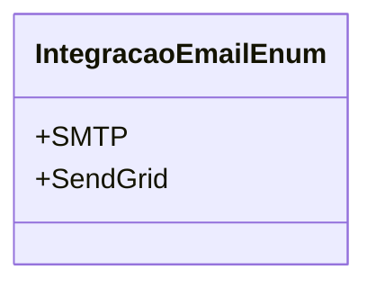

# IntegracaoEmailEnum
- **Namespace**: IsthmusWinthor.Dominio.Enumeradores
- **Nome do Arquivo**: IntegracaoEmailEnum.cs

Este enumerador é utilizado para definir os tipos de integrações de envio de e-mails suportados pelo sistema, facilitando a configuração e o gerenciamento dos métodos de integração de e-mail.

## Tipos Auxiliares e Dependências
- **Enumeradores**:
  - [IntegracaoEmailEnum](IntegracaoEmailEnum.md) 

## Diagrama de Relacionamentos

---
Gerada em 29/12/2025 20:57:04
