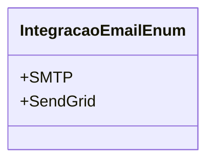

# IntegracaoEmailEnum

**Namespace**: IsthmusWinthor.Dominio.Enumeradores  
**Nome do Arquivo**: IntegracaoEmailEnum.cs  

IntegracaoEmailEnum é um enumerador responsável por definir as opções de integração de serviços de email disponíveis no sistema, facilitando a configuração e padronização do envio de emails, promovendo assim uma melhor experiência do usuário e uma entrega de mensagens mais eficiente.

## Métodos de Negócio

Neste caso, não há métodos com lógica a serem documentados, pois o enumerador é uma simples definição de valores.

## Propriedades Calculadas e de Validação

Não existem propriedades calculadas ou de validação, já que este é um enumerador.

## Navigations Property

Não há propriedades complexas do domínio, pois este é um enumerador.

## Tipos Auxiliares e Dependências

Este enumerador não possui dependências de classes auxiliares ou outros enumeradores.

## Diagrama de Relacionamentos

