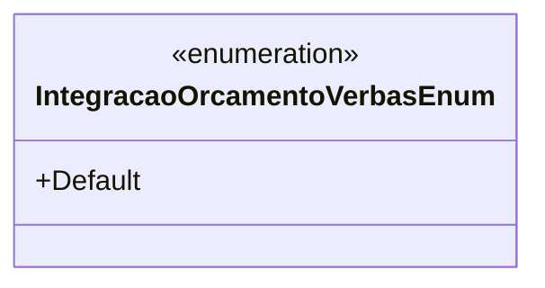

# IntegracaoOrcamentoVerbasEnum

- **Namespace**: IsthmusWinthor.Dominio.Enumeradores
- **Nome do Arquivo**: IntegracaoOrcamentoVerbasEnum.cs

Este enum é utilizado para identificar diferentes estados ou tipos de integração relacionados às verbas orçamentárias dentro do sistema, servindo como uma classificação padronizada para facilitar a manipulação e verificação de dados durante a execução de rotinas relacionadas à gestão orçamentária. 

## Tipos Auxiliares e Dependências
- Não há classes complexas do domínio e propriedades diretas a serem listadas nesta enumeração.

### Enumeração
- `IntegracaoOrcamentoVerbasEnum`: Enum que contém os estados ou tipos referentes à integração de verbas orçamentárias.  
  - **Valores**: 
    - `Default`: Representa o estado padrão de integração, utilizado quando não há uma especificação particular.

## Diagrama de Relacionamentos

Este diagrama representa a enumeração `IntegracaoOrcamentoVerbasEnum`. Como uma enumeração isolada, não possui relações diretas com outras classes ou enumerações no contexto atual.
---
Gerada em 29/12/2025 20:57:09
