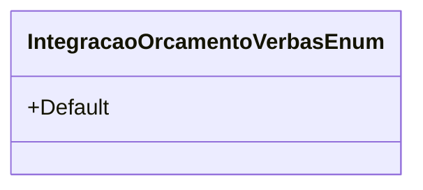

# IntegracaoOrcamentoVerbasEnum
**Namespace**: IsthmusWinthor.Dominio.Enumeradores  
**Nome do Arquivo**: IntegracaoOrcamentoVerbasEnum.cs  

Este enumerador tem a finalidade de categorizar e identificar diferentes tipos de integrações relacionadas a orçamentos e verbas dentro do domínio do sistema.

## Tipos Auxiliares e Dependências
- **Enums**: 
  - `[IntegracaoOrcamentoVerbasEnum](IntegracaoOrcamentoVerbasEnum.md)`

## Diagrama de Relacionamentos

