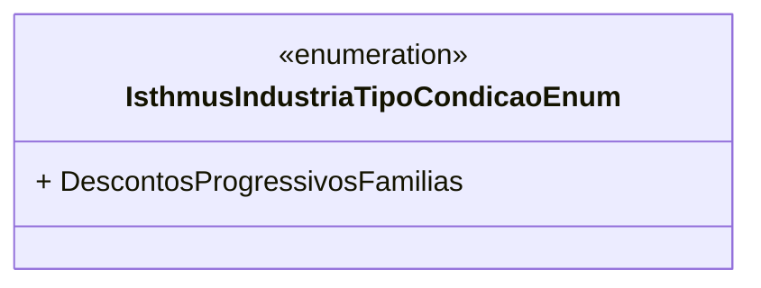

# IsthmusIndustriaTipoCondicaoEnum
**Namespace**: IsthmusWinthor.Dominio.Enumeradores  
**Nome do Arquivo**: IsthmusIndustriaTipoCondicaoEnum.cs  

Este tipo enumerado define as condições da indústria no contexto de aplicação, especificamente voltadas para o gerenciamento de condições de desconto progressivo por famílias de SKUs.

## Tipos Auxiliares e Dependências
- Enum: `[IsthmusIndustriaTipoCondicaoEnum](IsthmusIndustriaTipoCondicaoEnum.md)`  

--- 

