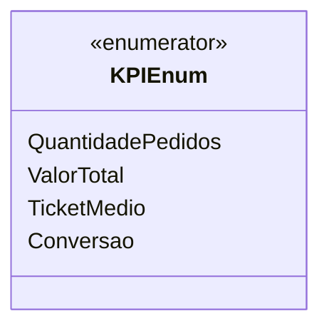

# KPIEnum
**Namespace**: IsthmusWinthor.Dominio.Enumeradores  
**Nome do Arquivo**: KPIEnum.cs  

KPIEnum é um enumerador que define diferentes indicadores de desempenho (KPIs) utilizados para medir e analisar o desempenho de negócios, como pedidos, valores totais, ticket médio e taxas de conversão. É fundamental para a construção de relatórios e análises de performance.

## Tipos Auxiliares e Dependências
- Enumeradores:
  - `[KPIEnum](KPIEnum.md)`

## Diagrama de Relacionamentos

