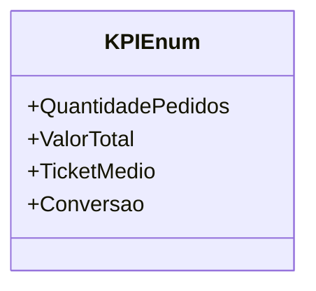

# KPIEnum
**Namespace**: IsthmusWinthor.Dominio.Enumeradores  
**Nome do Arquivo**: KPIEnum.cs  

Esta classe é um enumerador que define constantes para os principais indicadores de desempenho (KPIs) utilizados em análises de negócios.

## Tipos Auxiliares e Dependências
- **Enumeradores**:
  - [KPIEnum](KPIEnum.md)

## Diagrama de Relacionamentos

---
Gerada em 29/12/2025 20:57:16
