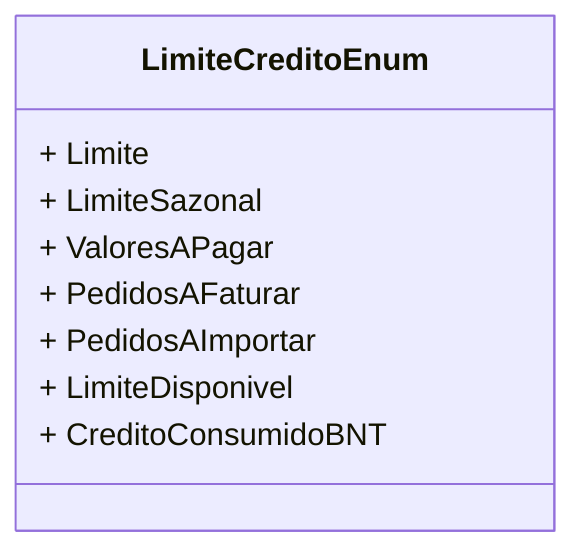

# LimiteCreditoEnum
**Namespace**: IsthmusWinthor.Dominio.Enumeradores  
**Nome do Arquivo**: LimiteCreditoEnum.cs  

## Visão Geral e Responsabilidade
A enumeração `LimiteCreditoEnum` define os diferentes estados e tipos relacionados ao limite de crédito em um sistema financeiro. Ela fornece uma representação clara dos componentes que afetam a disponibilidade de crédito de um cliente, permitindo que a aplicação avalie a situação do crédito de forma eficiente e precisa.

## Tipos Auxiliares e Dependências
- **Enumeradores**:
  - `[LimiteCreditoEnum](LimiteCreditoEnum.md)`

## Diagrama de Relacionamentos

