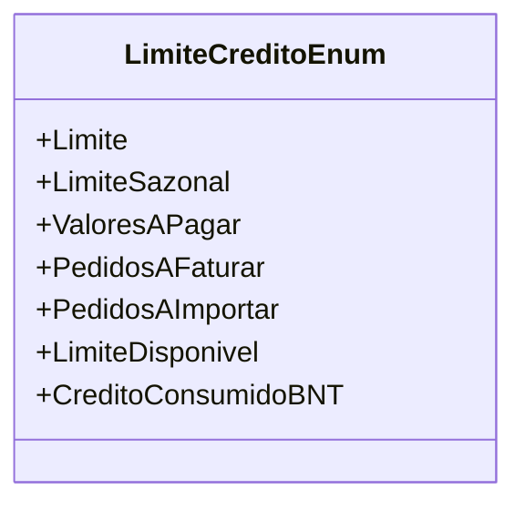

# LimiteCreditoEnum
**Namespace**: IsthmusWinthor.Dominio.Enumeradores  
**Nome do Arquivo**: LimiteCreditoEnum.cs  

O `LimiteCreditoEnum` é um enumerador que define diferentes categorias de limite de crédito em um sistema de gestão financeira. Cada valor representa uma condição específica que pode influenciar a avaliação do crédito de um cliente ou entidade.

## Tipos Auxiliares e Dependências
- Nenhum tipo auxiliar ou classe estática depende desta classe.

## Diagrama de Relacionamentos

### Notas:
O enumerador `LimiteCreditoEnum` pode ser utilizado em diversos contextos de negócio, sendo crucial para a análise de crédito e a definição de condições financeiras dentro do sistema.
---
Gerada em 29/12/2025 20:57:21
