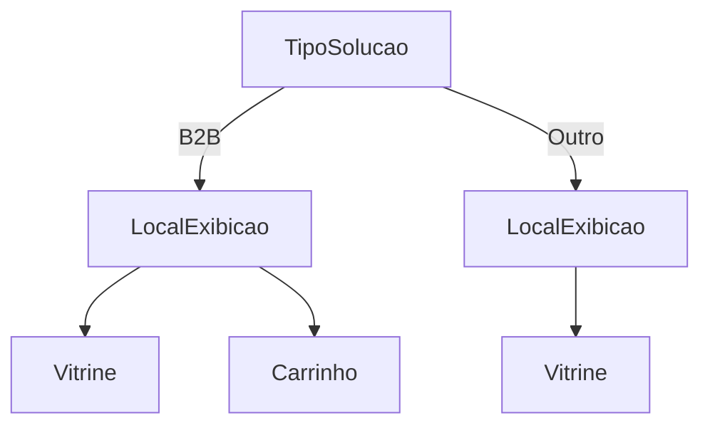
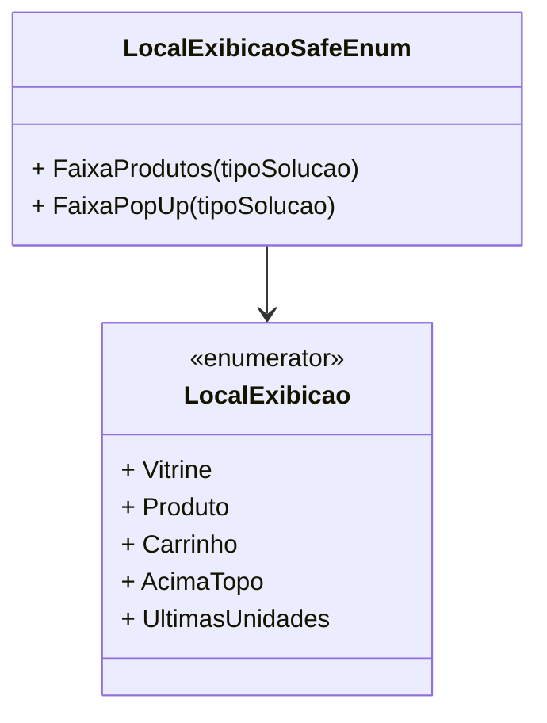

# LocalExibicao

**Namespace**: IsthmusWinthor.Dominio.Enumeradores  
**Nome do Arquivo**: LocalExibicao.cs  

## Visão Geral e Responsabilidade
A classe `LocalExibicao` é um enumerador que define diferentes locais onde um produto pode ser exibido em um sistema de e-commerce. O objetivo deste enumerador é facilitar a identificação dos contextos em que os produtos podem ser apresentados aos usuários, assegurando que as soluções apresentadas sejam adequadas ao tipo de exibição desejada.

## Métodos de Negócio

### Título: FaixaProdutos (Visibilidade: public static)
- **Objetivo**: Retornar uma lista de locais de exibição padrão para diferentes tipos de soluções.
- **Comportamento**: Este método cria e retorna uma lista contendo os valores `Vitrine`, `Produto` e `Carrinho` do enum `LocalExibicao`, que são os três lugares onde os produtos geralmente são exibidos, independentemente do tipo de solução.
- **Retorno**: Uma lista de `LocalExibicao` que contém os locais de exibição disponíveis.

### Título: FaixaPopUp (Visibilidade: public static)
- **Objetivo**: Determinar os locais de exibição para um pop-up com base no tipo de solução.
- **Comportamento**: O método verifica o tipo de solução passado como parâmetro. Se for do tipo `B2B`, retorna uma lista com `Vitrine` e `Carrinho`. Para qualquer outro tipo de solução, retorna apenas `Vitrine`. Isso garante que a exibição do pop-up seja adaptada conforme a necessidade do cliente.
  

## Propriedades Calculadas e de Validação
- Não há propriedades calculadas ou de validação nesta classe, pois todas as propriedades são de enumeração.

## Navigations Property
- Não existem Navigations Properties nesta classe, pois `LocalExibicao` é um enumerador.

## Tipos Auxiliares e Dependências
- **Enumerador**: 
  - [LocalExibicao](LocalExibicao.md)
- **Classes Estáticas**:
  - [LocalExibicaoSafeEnum](LocalExibicaoSafeEnum.md)

## Diagrama de Relacionamentos

---
Gerada em 29/12/2025 20:57:33
