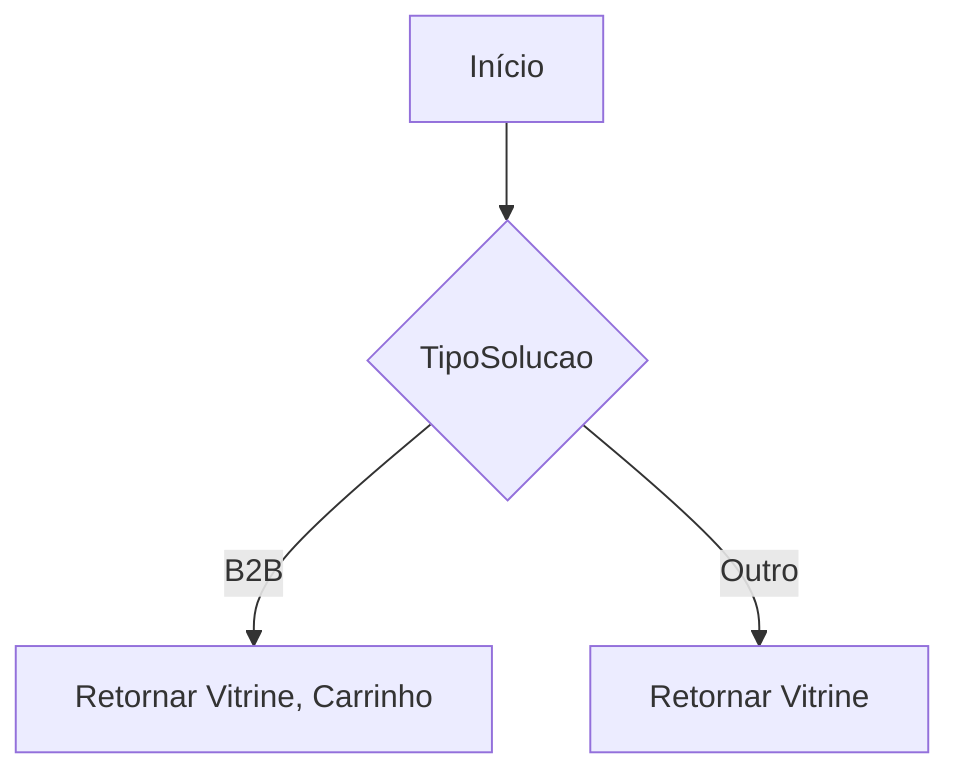
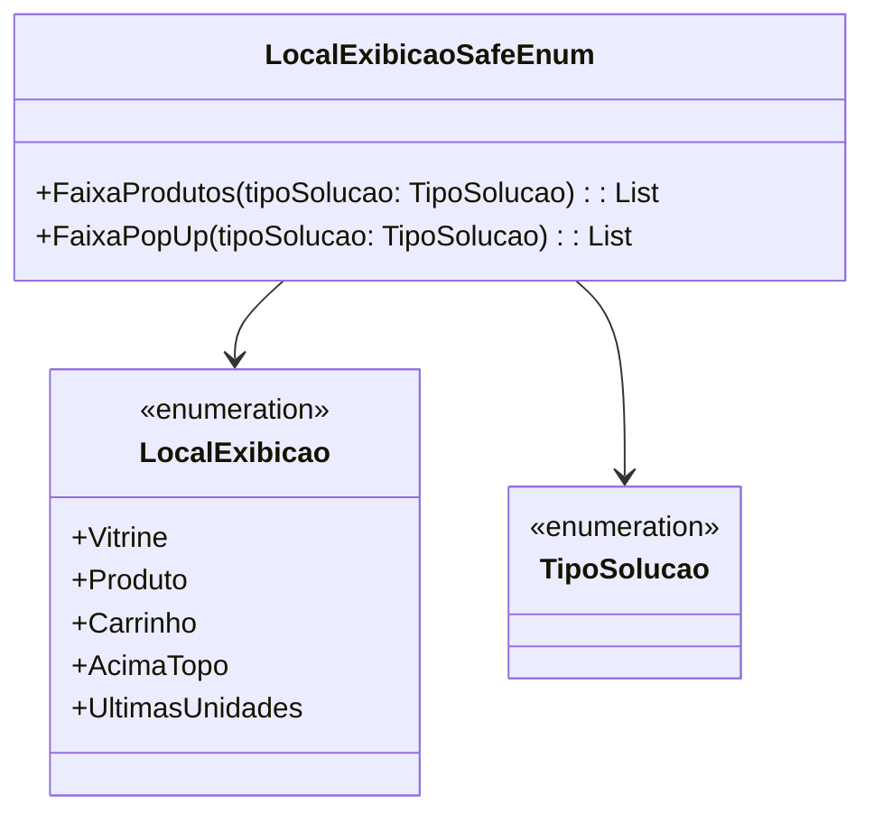

# LocalExibicao

**Namespace**: IsthmusWinthor.Dominio.Enumeradores  
**Nome do Arquivo**: LocalExibicao.cs  

## Visão Geral e Responsabilidade
A enumeração `LocalExibicao` define diversos locais nos quais produtos podem ser exibidos no sistema, contribuindo para a lógica de apresentação da interface do usuário em um cenário de e-commerce. O uso correto dessa enumeração permite que o sistema apresente os produtos de maneira adequada, facilitando a visibilidade e a experiência do usuário ao navegar na plataforma.

## Métodos de Negócio

### Título: FaixaProdutos (Estático)
- **Objetivo**: Garante que os locais apropriados para exibição de produtos sejam sempre utilizados, baseado no tipo de solução.
- **Comportamento**: 
  1. O método `FaixaProdutos` recebe um parâmetro `tipoSolucao`.
  2. Retorna uma lista contendo os locais de exibição que sempre estão disponíveis para qualquer tipo de solução.
- **Retorno**: Retorna uma lista de `LocalExibicao` que contém `Vitrine`, `Produto`, e `Carrinho`.

### Título: FaixaPopUp (Estático)
- **Objetivo**: Garante que os locais de exibição para pop-ups sejam adequados ao tipo de solução, otimizando a relevância da apresentação.
- **Comportamento**: 
  1. O método `FaixaPopUp` recebe um parâmetro `tipoSolucao`.
  2. Se o tipo de solução for `B2B`, retorna uma lista com `Vitrine` e `Carrinho`.
  3. Caso contrário, retorna apenas `Vitrine`.
- **Retorno**: Retorna uma lista de `LocalExibicao` contendo os locais permitidos para exibição de acordo com o tipo de solução.

## Propriedades Calculadas e de Validação
- Não existem propriedades calculadas ou de validação na enumeração `LocalExibicao`.

## Navigations Property
- Não existem propriedades de navegação nesta classe.

## Tipos Auxiliares e Dependências
- `TipoSolucao` - Enumeração que categoriza o tipo de solução do fluxo de produtos.

## Diagrama de Relacionamentos

