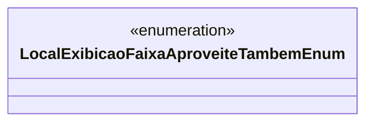

# LocalExibicaoFaixaAproveiteTambemEnum
**Namespace**: IsthmusWinthor.Dominio.Enumeradores  
**Nome do Arquivo**: LocalExibicaoFaixaAproveiteTambemEnum.cs  

Este enum define locais possíveis de exibição da faixa "Aproveite Também" nas páginas de produtos, servindo como um meio para padronizar e garantir que as escolhas de localização sejam consistentes em toda a aplicação.  

## Tipos Auxiliares e Dependências
- Enumeradores:
  - [LocalExibicaoFaixaAproveiteTambemEnum](LocalExibicaoFaixaAproveiteTambemEnum.md)  

## Diagrama de Relacionamentos

---
Gerada em 29/12/2025 20:57:36
