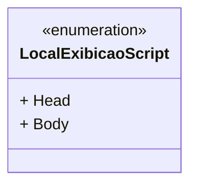

# LocalExibicaoScript
**Namespace**: IsthmusWinthor.Dominio.Enumeradores  
**Nome do Arquivo**: LocalExibicaoScript.cs  

Esta classe é um enumerador que define constantes para o local de exibição de um script, sendo utilizada para melhorar a legibilidade e manutenibilidade do código onde scripts são injetados em uma aplicação.

## Tipos Auxiliares e Dependências
- **Enumeradores**:
  - `[LocalExibicaoScript](LocalExibicaoScript.md)`

## Diagrama de Relacionamentos

