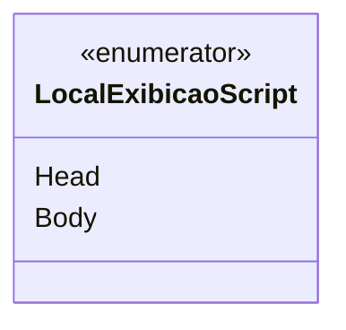

# LocalExibicaoScript
**Namespace**: IsthmusWinthor.Dominio.Enumeradores  
**Nome do Arquivo**: LocalExibicaoScript.cs  

Este é um enumerador que define os locais de exibição de scripts em uma aplicação, servindo como um meio de transporte de dados relacionados à configuração de visualização no sistema.

### Tipos Auxiliares e Dependências
- Enumeradores:
  - [LocalExibicaoScript](LocalExibicaoScript.md)

### Diagrama de Relacionamentos

---
Gerada em 29/12/2025 20:57:40
