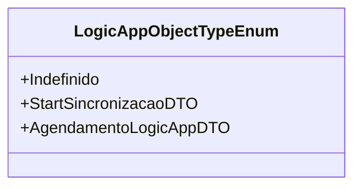

# LogicAppObjectTypeEnum
**Namespace**: IsthmusWinthor.Dominio.Enumeradores  
**Nome do Arquivo**: LogicAppObjectTypeEnum.cs  

Este enumerador é utilizado como um tipo auxiliar, definindo os diferentes tipos de objetos que podem ser utilizados na lógica de operação dentro da aplicação. Sua finalidade é contribuir para a implementação de regras de negócio relacionadas ao processamento e execução de operações em fluxo de trabalho.

## Tipos Auxiliares e Dependências
- **Enumeradores**:
  - [LogicAppObjectTypeEnum](LogicAppObjectTypeEnum.md)

## Diagrama de Relacionamentos

---
Gerada em 29/12/2025 20:57:43
