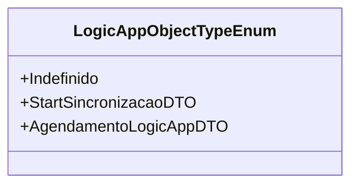

# LogicAppObjectTypeEnum
**Namespace**: IsthmusWinthor.Dominio.Enumeradores  
**Nome do Arquivo**: LogicAppObjectTypeEnum.cs  

Este enumerador é utilizado para definir os tipos de objetos que podem ser manipulados em uma aplicação de lógica, facilitando a segregação dos diferentes tipos de dados que podem ser processados.

## Tipos Auxiliares e Dependências
- Nenhuma classe complexa ou navegação associada está presente.
- Enumeradores utilizados:
  - `[LogicAppObjectTypeEnum](LogicAppObjectTypeEnum.md)` 

## Diagrama de Relacionamentos

